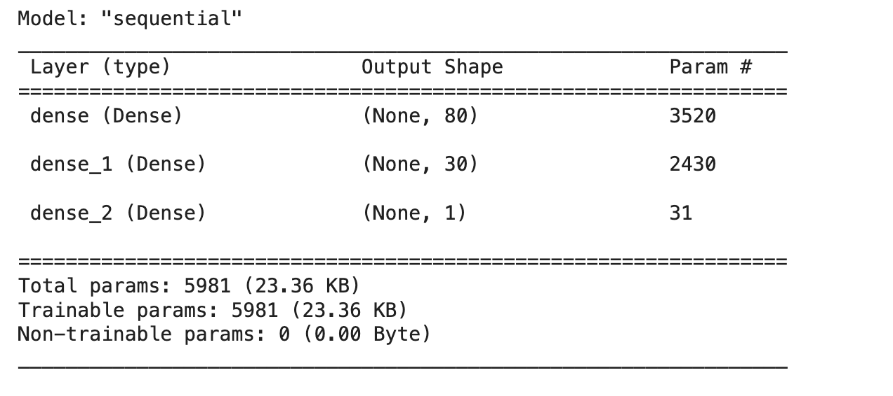
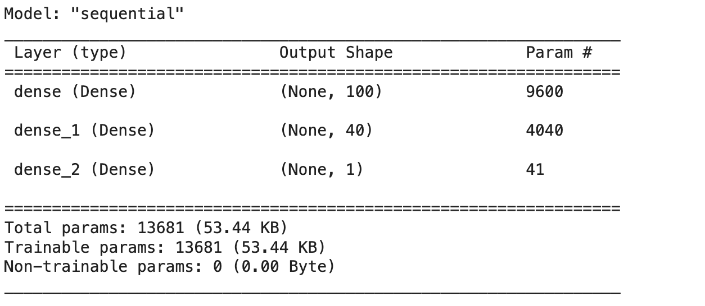

# Nonprofit_Foundation_Alphabet_Soup

Create a tool that can help the foundation select the applicants for funding with the best chance of success in their ventures. 

## Table of Contents

- [Getting Started](#getting-started)
- [Prerequisites](#Prerequisites)
- [Coding Instruction](#Coding-Instruction)
- [Report](#Report)
- [References](#references)
  
## Getting Started

Using machine learning and neural networks, use the features in the provided dataset to create a binary classifier that can predict whether applicants will be successful if funded by Alphabet Soup.

## Prerequisites

Requirements for the software and other tools to build, test and push 

- [Pandas](https://pypi.org/project/pandas/)
- [Jupyter Notebook](https://jupyter.org/)
- [StandardScaler](https://pypi.org/project/StandardScaler/)
- [tensorflow](https://pypi.org/project/tensorflow/)

## Coding Instruction

#### What does the dataset contain?

Within this dataset are several columns that capture metadata about each organization, such as:

1. EIN and NAME — Identification columns
2. APPLICATION_TYPE — Alphabet Soup application type
3. AFFILIATION — Affiliated sector of industry
4. CLASSIFICATION — Government organization classification
5. USE_CASE — Use case for funding
6. ORGANIZATION — Organization type
7. STATUS — Active status
8. INCOME_AMT — Income classification
9. SPECIAL_CONSIDERATIONS — Special considerations for application
10. ASK_AMT — Funding amount requested
11. IS_SUCCESSFUL — Was the money used effectively

#### Step 1: Preprocess the Data

Using your knowledge of Pandas and scikit-learn’s StandardScaler(), you’ll need to preprocess the dataset. This step prepares you for Step 2, where you'll compile, train, and evaluate the neural network model. Using the information we have provided in the starter code, follow the instructions to complete the preprocessing steps.

1. Read in the charity_data.csv to a Pandas DataFrame, and be sure to identify the following in your dataset:
 - What variable(s) are the target(s) for your model?
 - What variable(s) are the feature(s) for your model?
 - Drop the EIN and NAME columns.
   
2. Drop the EIN and NAME columns.
   
3. Determine the number of unique values for each column.
   
4. For columns that have more than 10 unique values, determine the number of data points for each unique value.

5. Use the number of data points for each unique value to pick a cutoff point to bin "rare" categorical variables together in a new value, Other, and then check if the binning was successful.

6. Use pd.get_dummies() to encode categorical variables.

7. Split the preprocessed data into a features array, X, and a target array, y. Use these arrays and the train_test_split function to split the data into training and testing datasets.

8. Scale the training and testing features datasets by creating a StandardScaler instance, fitting it to the training data, then using the transform function.

#### Step 2: Compile, Train, and Evaluate the Model

Using your knowledge of TensorFlow, you’ll design a neural network, or deep learning model, to create a binary classification model that can predict if an Alphabet Soup–funded organization will be successful based on the features in the dataset. You’ll need to think about how many inputs there are before determining the number of neurons and layers in your model. Once you’ve completed that step, you’ll compile, train, and evaluate your binary classification model to calculate the model’s loss and accuracy.

1. Continue using the Jupyter Notebook in which you performed the preprocessing steps from Step 1.

2. Create a neural network model by assigning the number of input features and nodes for each layer using TensorFlow and Keras.

3. Create the first hidden layer and choose an appropriate activation function.

4. If necessary, add a second hidden layer with an appropriate activation function.

5. Create an output layer with an appropriate activation function.

6. Check the structure of the model.

7. Compile and train the model.

8. Create a callback that saves the model's weights every five epochs.

9. Evaluate the model using the test data to determine the loss and accuracy.

10. Save and export your results to an HDF5 file. Name the file AlphabetSoupCharity.h5.
    
#### Step 3: Optimize the Model

Using your knowledge of TensorFlow, optimize your model to achieve a target predictive accuracy higher than 75%.

- Adjust the input data to ensure that no variables or outliers are causing confusion in the model, such as:
   - Dropping more or fewer columns.
   - Creating more bins for rare occurrences in columns.
   - Increasing or decreasing the number of values for each bin.
   - Add more neurons to a hidden layer.
   - Add more hidden layers.
   - Use different activation functions for the hidden layers.
   - Add or reduce the number of epochs to the training regimen.

- Note: If you make at least three attempts at optimizing your model, you will not lose points if your model does not achieve target performance.

1. Create a new Google Colab file and name it AlphabetSoupCharity_Optimization.ipynb.

2. Import your dependencies and read in the charity_data.csv to a Pandas DataFrame.

3. Preprocess the dataset as you did in Step 1. Be sure to adjust for any modifications that came out of optimizing the model.

4. Design a neural network model, and be sure to adjust for modifications that will optimize the model to achieve higher than 75% accuracy.

5. Save and export your results to an HDF5 file. Name the file AlphabetSoupCharity_Optimization.h5.

#### Step 4: Write a Report on the Neural Network Model
For this part of the assignment, you’ll write a report on the performance of the deep learning model you created for AlphabetSoup.
The report should contain the following:

1. Overview of the analysis: Explain the purpose of this analysis.

2. Results: Using bulleted lists and images to support your answers, address the following questions:

- Data Preprocessing

  - What variable(s) are the target(s) for your model?
  - What variable(s) are the features for your model?
  - What variable(s) should be removed from the input data because they are neither targets nor features?

 - Compiling, Training, and Evaluating the Model

    - How many neurons, layers, and activation functions did you select for your neural network model, and why?
    - Were you able to achieve the target model performance?
    - What steps did you take in your attempts to increase model performance?

3. Summary: Summarize the overall results of the deep learning model. Include a recommendation for how a different model could solve this classification problem, and then explain your recommendation.

## Report

#### Overview of the analysis:
The purpose of this analysis is to summarize the overall results of the original deep learning model, which involves evaluating its performance metrics such as accuracy, precision, recall, and F1 score. Additionally, the analysis will also look at the alternative approach for the second model and will end up recommending the best model to use while looking at evidence.

#### Results: 

- Data Preprocessing:
  
  - What variable(s) are the target(s) for your model?

    The target variable for my model is “IS_SUCCESSFUL” which provided insight into the success or failure of previous projects.
    
  - What variable(s) are the features for your model?

    The feature variables include APPLICATION_TYPE, AFFILIATION, CLASSIFICATION, USE_CASE, ORGANIZATION, STATUS, INCOME_AMT,
    SPECIAL_CONSIDERATIONS, and ASK_AMT.
    
  - What variable(s) should be removed from the input data because they are neither targets nor features?

    EIN and NAME which were dropped because they are identifiers and do not provide predictive information and that’s why it is neither
    targets nor features.

- Compiling, Training, and Evaluating the Model:
  
  - How many neurons, layers, and activation functions did you select for your neural network model, and why?

    For my  neural network model , I have 100 neurons in the first hidden layer and 40 neurons in the second hidden and 1 neuron in the
    output layer. The first and second hidden layers use the “Relu” activation function, while the output layer uses the “sigmoid”
    activation function.

Original:

Mine:

  - Were you able to achieve the target model performance?

    Yes, with a result of 76% accuracy.
    
  - What steps did you take in your attempts to increase model performance?

     Including the 'NAME' column among the feature variables helped enhance the accuracy by providing additional crucial data points.
     Increasing the number of hidden nodes for each layer resulted in an overall improvement in the model's accuracy.

#### Summary: 

The deep learning model achieved an overall accuracy of 76% in classifying the data. While this accuracy may be satisfactory for some applications, there is still room for improvement. One recommendation for potentially improving the classification performance is to explore the use of different activation functions for the hidden layers and adding or reducing the number of epochs to the training regimen.

## References

IRS. Tax Exempt Organization Search Bulk Data Downloads. [IRS Site](https://www.irs.gov/charities-non-profits/tax-exempt-organization-search-bulk-data-downloads)  to an external site.

